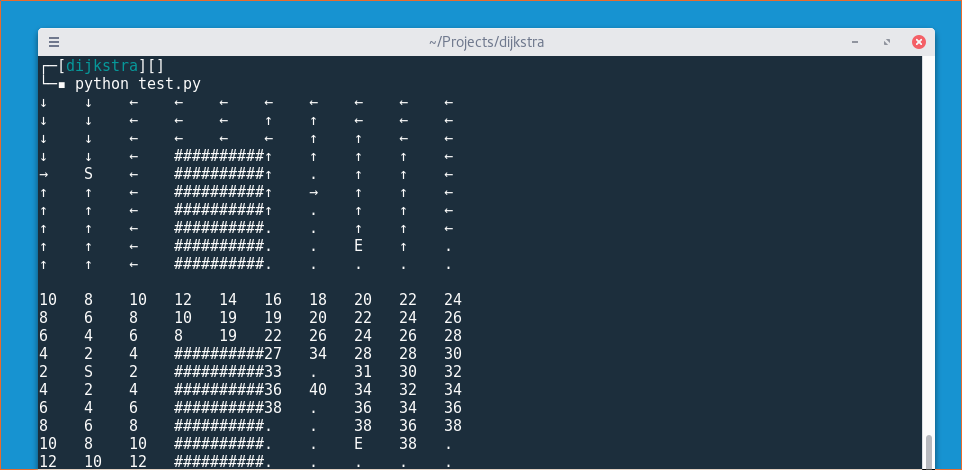

# What is THIS?

A Pythonic implementation of the famous A* algorithm.

# Why ANOTHER implementation

Because coding is awesome! Also because I really dislike the mess that the usual implementations creates. The A* algorithm is simple and beautiful and so must be its implementation.

# How is THIS diferent?

This is different because I refactored all the logic in propositional layers. This is achieved grouping together the parts of the algorithm that has the same level of abstraction, exposing the pure logic of A* in its higher layer.

# How can it be TESTED?

It comes with a `test_a_star.py` snippet to test the algorithm in a simple weighted maze ( with random weights ). If you run it you will obtain something like this:

<p align="center">

</p>

# Can you EXPLAIN the algorithm?

Yeah! The idea of the A* algorithm is that starting from the start point we visit the points that are cheaper to visit. The cost of visiting a neighbor point depends on how costly is to go from the current point to a neighbor. So we check for all the points what is the neighbor that is cheaper to visit and we visit it.

The A* algorithm is basically the following:

```python
def a_star(graph, start, end):
    """
    Calculates the shortest path from start to end.

    :param graph: A graph object. The graph object can be anything that implements the following methods:

        graph.neighbors( (x:int, y:int) ) : Iterable( (x:int,y:int), (x:int,y:int), ...)
        graph.cost( (x:int,y:int) ) : int

    :param start: Tuple of two ints representing the starting point.
    :param end: Tuple of two ints representing the ending point.
    :returns: A DijkstraHeap object.

    """

    frontier = DijkstraHeap( Node(0, start, None) )

    while frontier:

        current_node = frontier.pop()

        if current_node.value == end:
            return frontier

        for neighbor in graph.neighbors( current_node.value ):

            new_cost = ( current_node.priority
                         + graph.cost(current_node.value, neighbor)
                         + heuristic( neighbor, end) )

            new_node = Node(new_cost, neighbor, current_node.value)

            frontier.insert(new_node)

```

Lets go line by line:

```python
frontier = DijkstraHeap( Node(0, start, None) )
```

This line creates a DijkstraHeap object. We will see later how this can be implemented but the best part is that....This is not part of the algorithm! What is a DijkstraHeap then? This is a **priority queue** that has the following properties:

* If we try to insert an already visited element in the queue the DijkstraHeap will do nothing.
* The DijkstraHeap always pop the element that has the lowest cost and NEVER pops an already visited element.

Cool! So this DijkstraHeap knows the visiting order of the elements. Its **like a heap but never pops an already visited element**.

```python
while frontier:
```

We loop while we have elements in the queue.

```python
current_node = frontier.pop()
```

Each iteration we pop an element from the DijkstraHeap. This element always has the lowest cost element because the DijkstraHeap has this property ( because is a heap and heaps are awesome ).

```python
if current_node.value == end:
    return frontier
```

If we have reached the end, we stop and return the DijkstraHeap that has all the information about our path (because it knows how we reach each element).

```python
for neighbor in graph.neighbors( current_node.value ):
```

We get each of the current point neighbors

```python
new_cost = ( current_node.priority
            + graph.cost(current_node.value, neighbor)
            + heuristic( neighbor, end) )

new_node = Node(new_cost, neighbor, current_node.value)

frontier.insert(new_node)

```

For each neighbor we calculate the new cost of reaching this neighbor from the current point. This cost is formed by three quantities:

1. The current cost of reaching the current point.
2. The cost of going from the current point to the neighbor.
3. The distance of the neighbor to the end point that we are looking.

Why this 3rd cost? Because we want to explore first the points that are near the end destination and expend less time in the points that are far from it. So if we artificially give the point a higher cost if the point is far from the destination it will be visited later.

When we have calculated this new cost we insert the point in the priority queue.

## But what about the MISTERIOUS DijkstraHeap?

Is like I said a heap that remembers the visited elements and where they came from and never pops an already visited element. The implementation is very simple:

```python
class DijkstraHeap(list):
    """
    An augmented heap for the A* algorithm. This class encapsulated the residual logic of
    the A* algorithm like for example how to manage elements already visited that remain
    in the heap, elements already visited that are not in the heap and from where we came to
    a visited element.

    This class will have three main elements:

        - A heap that will act as a priority queue (self).
        - A visited dict that will act as a visited set and as a mapping of the form  point:came_from
        - A costs dict that will act as a mapping of the form point:cost_so_far
    """
    def __init__(self, first_node = None):
        self.visited = dict()
        self.costs = dict()

        if first_node is not None:
            self.insert(first_node)

    def insert(self, element):
        """
        Insert an element into the Dijkstra Heap.

        :param element: A Node object.
        :return: None
        """

        if element.value not in self.visited:
            heapq.heappush(self,element)

    def pop(self):
        """
        Pop an element from the Dijkstra Heap, adding it to the visited and cost dicts.

        :return: A Node object
        """

        while self and self[0].value in self.visited:
            heapq.heappop(self)

        next_elem = heapq.heappop(self)
        self.visited[next_elem.value] = next_elem.came_from
        self.costs[next_elem.value] = next_elem.priority
        return next_elem
```
